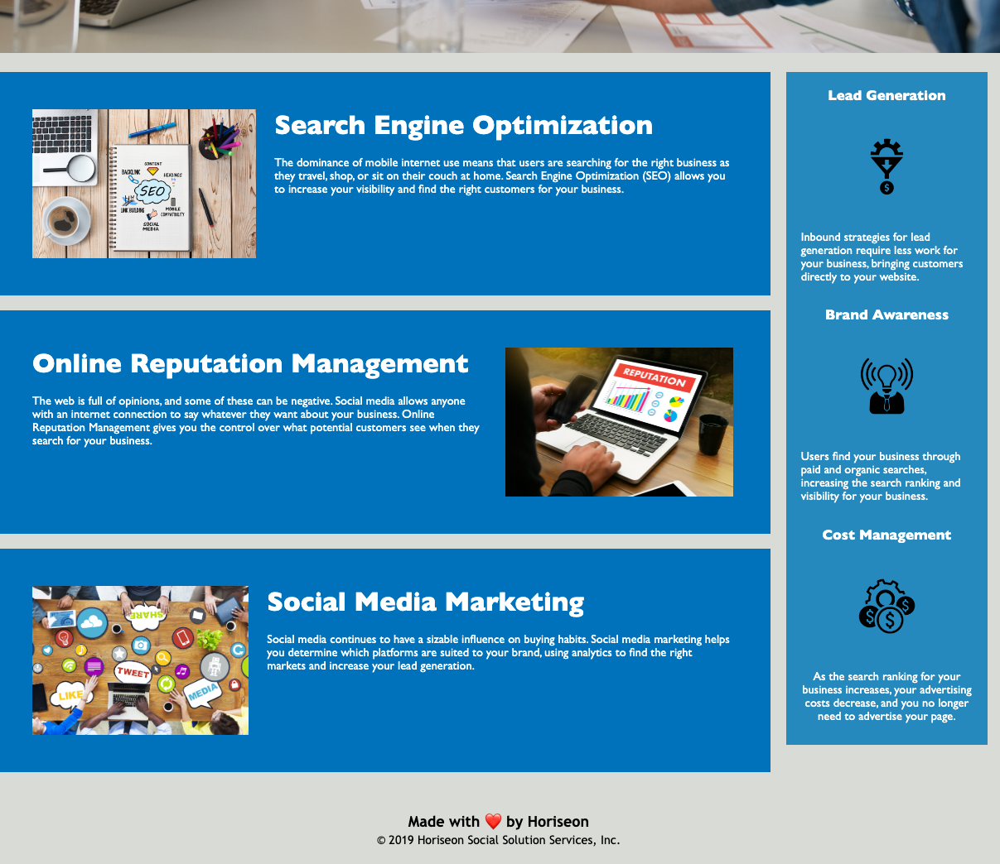

# refractor-code
6/23/22 Second submission:

Links:
https://github.com/cassandrakise/refractor-code 
https://cassandrakise.github.io/refractor-code/

Screenshot:

________________
6/16/22 First submission:

GIVEN a webpage meets accessibility standards
WHEN I view the source code
THEN I find semantic HTML elements
WHEN I view the structure of the HTML elements
THEN I find that the elements follow a logical structure independent of styling and positioning
WHEN I view the image elements
THEN I find accessible alt attributes
WHEN I view the heading attributes
THEN they fall in sequential order
WHEN I view the title element
THEN I find a concise, descriptive title
